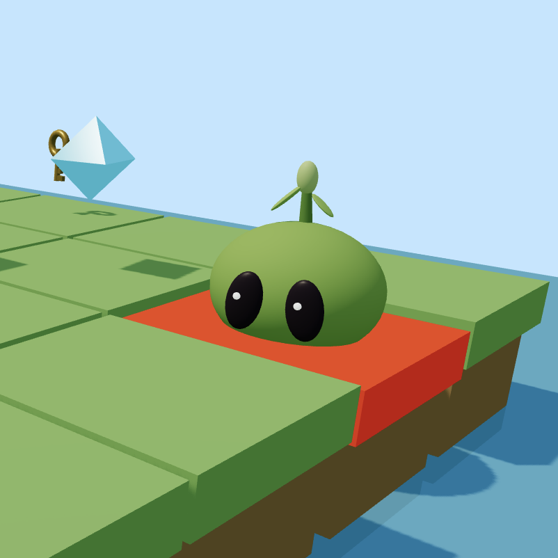

# Can LLMs Plan?

> An interactive study of LLMs' ability to create spatial plans in grid worlds, inspired by **[LLM-BabyBench: Understanding and Evaluating Grounded Planning and Reasoning in LLMs](https://www.alphaxiv.org/abs/2505.12135)** (Choukrani et al., MBZUAI, NeurIPS 2025).

<samp>
  

    
  

</samp>

  

Meet **Mo the Mossball**. His world is a puzzle with gems to collect, an exit to reach, and lava that kills on contact. A child can solve it easily. Ask an LLM and it will often send him straight into the lava. We observe why this happens, what helps and how it explains the industry's recent move to agents.

The notebook was tailored and tested to run in molab, but can be adapted to run on any hardware, or using off-the-shelf LLM APIs.

## Walk-through

| Act | What's in it |
|---|---|
| **1 · Meet Mo** | Write your own Python to solve the world for Mo |
| **2 · Build worlds** | Create grid worlds by hand or generate with different configs (size, obstacles, gems, locked doors). They come solved with BFS oracle. |
| **3 · The model plans** | Delegate the solving task to a LLM. Try different models and thinking toggle. |
| **4 · The model writes code** | Give the model a sandbox + a verifier; it writes a solver instead of planning by hand, and solves what it couldn't plan |
| **5 · Does it scale?** | See the systematic study we build based on all shown approaches: how does the success and cost scale across grid sizes |

## Data

The dataset shown in Act 5 is [available publicly](https://huggingface.co/datasets/orbrx/wanderland-llm-planning) (CC-BY-4.0) and includes a scan across every approach (no thinking, thinking, code tool, agentic loop with code writing and code execution feedback) × grid size × seed.

## Built with

<table>
<tr>
  <td width="33%" align="center"></td>
  <td width="33%" align="center"><a href="https://github.com/ktaletsk/wanderland"><b>🌱 wanderland</b></a></td>
  <td width="33%" align="center"><a href="https://github.com/orbrx/featherlm"><b>🪶 featherlm</b></a></td>
</tr>
<tr>
  <td valign="top"><a href="https://marimo.io"><b>marimo</b></a>: reactive Python notebooks. Build a world or click a chart point and every dependent cell recomputes; the model's answer becomes a variable that drives the rest of the notebook.</td>
  <td valign="top"><a href="https://github.com/ktaletsk/wanderland"><b>wanderland</b></a>: Mo's low-poly 3D grid world as a drop-in <a href="https://anywidget.dev">anywidget</a> (<code>pip install wanderland</code>). A faithful BabyAI/MiniGrid platform you steer from pure Python.</td>
  <td valign="top"><a href="https://github.com/orbrx/featherlm"><b>featherlm</b></a>, a tiny universal local-inference layer: load any Hugging Face model with the fastest config for your GPU, stream reasoning, native tool-calling. The whole model menu comes from <code>featherlm.MODELS</code>.</td>
</tr>
</table>

Both wanderland and featherlm are open-source libraries built for this work.

